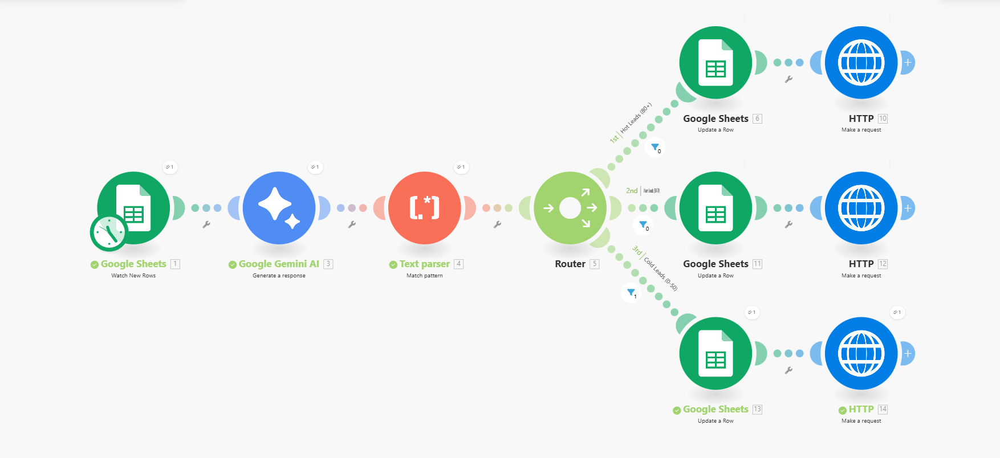

# Automated Lead Intelligence Pipeline

An AI-powered automation that turns raw investor leads into qualified, scored, and actionable insights in 30 seconds.

**Stack:** Make.com · Gemini 2.5-flash · Google Sheets · Slack

---

### 1. The Problem: 20+ Minutes Per Lead

Manually researching, scoring, and routing new leads is slow, repetitive, and doesn't scale.

### 2. The 30-Second AI Solution

This serverless pipeline runs 24/7 to:

1.  **Trigger:** Watch a Google Sheet for new leads.
2.  **Score:** Send lead data to **Gemini 2.5-flash** for AI-powered analysis, scoring (Hot/Warm/Cold), and next-step recommendations.
3.  **Route:** Instantly post a formatted, actionable alert to the correct **Slack** channel.

### 3. 📈 Measurable Impact (KPI)

- **Time Saved:** ~20 minutes of manual work per lead.
- **Result:** Frees up **16+ hours/month** (at 50 leads/mo) for the team to focus on _closing_ hot leads, not just _finding_ them.

### 4. 🚀 Proof of Work

- **Live Workflow:** **[View the Public Make.com Scenario](https://eu1.make.com/public/shared-scenario/Wb0p3zpSPel/integration-google-sheets)**
- **Scenario Blueprint:**
  
